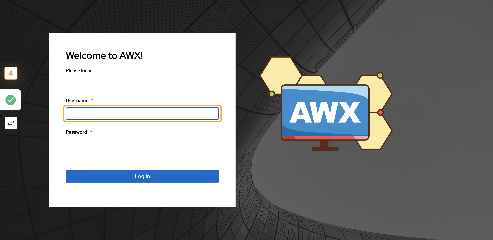

# Manual AWX Deployment(v 19.3.0)

- Deploy the OKE cluster with public subnets(for testing keep it open for all)
  - select the "Assign a public IP address" to the API endpoint box
  - keep only 1 node
  - keep more than 6 cpu and more than 5 gb memory
  - other things keep it default
  - provide a ssh key
- Click on access cluster >> launch cloud shell >> run the given command in the OCI popup
  - once you are inside the cluster, run the following commands
  1) ```oci ce cluster create-kubeconfig --cluster-id <cluste_id>> --file $HOME/.kube/config --region <region> --token-version 2.0.0 ```
  2) ```kubectl apply -f https://raw.githubusercontent.com/ansible/awx-operator/0.13.0/deploy/awx-operator.yaml```

- Create a file named `awx-demo.yml` with following contents
  - ```
    apiVersion: awx.ansible.com/v1beta1
    kind: AWX
    metadata:
      name: awx-demo
    spec:
      service_type: LoadBalancer
      loadbalancer_protocol: http
      loadbalancer_port: 8087
- Now run the below command
  - ```kubectl apply -f awx-demo.yml```
- Wait for few minutes and run
  - ```kubectl get svc -l "app.kubernetes.io/managed-by=awx-operator"```
  - and get the external ip and port and access awx ui in the browser.
- Run below command to get the default password for the awx ui, the username is `admin`
  - ```kubectl get secret awx-demo-admin-password -o jsonpath="{.data.password}" | base64 --decode```
- Finally, login into awx ui.


